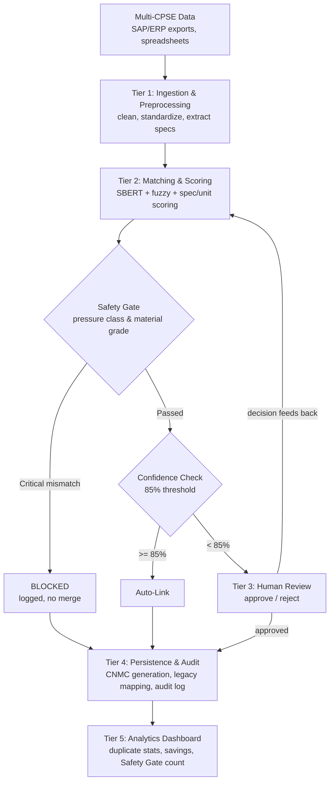

# AI-Driven Standardization and Harmonization of Material Codes Across CPSEs

**Smart India Hackathon 2026** · Problem Statement **SIH26099** · Ministry of Petroleum & Natural Gas
Theme: Smart Automation · Category: Software · Team: **Popeye**

---

## The Problem

Petroleum-sector CPSEs, ONGC, IOCL, BPCL, HPCL, GAIL, Oil India, each maintain their own material master catalog, built independently over decades. The same physical item ends up with a different code and a different description in every organization:

| CPSE | Code | Description |
|---|---|---|
| ONGC | VLV-18372 | GATE VALVE 4" 150# CS |
| IOCL | MAT-9281 | 4 IN GATE VALVE CARBON STEEL, 150 LB |
| BPCL | 47192 | GV 4" CS 150 |

Same valve. Three codes. No system today can tell you that.

The result: duplicate inventory, fragmented procurement, and missed bulk-buying opportunities that a unified view would immediately expose.

## What This Repository Contains

A working, tested pipeline that ingests material data from multiple CPSEs, matches items by **meaning** rather than spelling, and produces one **Common National Material Code (CNMC)** per real-world item, while keeping every original CPSE code fully traceable underneath it.

This is not a wrapper around an LLM. The matching engine is a purpose-built pipeline: semantic similarity, fuzzy string matching, structured specification extraction, and a rule-based safety layer, combined into one auditable confidence score.

## The Core Innovation: The Safety Gate

Text similarity alone cannot prove two materials are interchangeable. Two flanges can be described almost identically and still be fundamentally different parts.

**Real, unmodified output from this repository** (see [`src/matching/output_v2.txt`](src/matching/output_v2.txt)):

```
Item A: Flange WN RF 150# ASTM A105 6IN ASME B16.5
Item B: Flange WN RF 300# ASTM A105 6IN ASME B16.5

Text similarity: 94.5%   (a generic matcher would auto-merge this)
Safety Gate check: pressure_class differs -> 150 vs 300
Result: BLOCKED, routed to human review with the reason logged
```

A 300# flange and a 150# flange are not interchangeable in the field. Merging them would be a real procurement and safety error, not a rounding difference. The Safety Gate hard-blocks any merge where a critical attribute, pressure class or material grade, differs between two candidate items, independent of how confident the text-matching score is. This is a deterministic rule, not a probabilistic guess, so it is fully explainable to an auditor.

## Architecture



Full data contracts between every tier are documented in [`ARCHITECTURE.md`](ARCHITECTURE.md).

## Repository Structure

```
├── README.md                    this file
├── ARCHITECTURE.md               exact data contracts between tiers
├── docs/                         per-tier specification documents
├── data/
│   ├── raw/                      sample multi-CPSE catalogs (differently formatted, on purpose)
│   └── processed/                Tier 1 output, review decisions, audit records
├── src/
│   ├── ingestion/                Tier 1 — multi-format catalog loader and cleaner
│   ├── matching/                 Tier 2 — matching engine and the Safety Gate
│   ├── review_api/                Tier 3 — human review API and interface
│   ├── persistence/               Tier 4 — CNMC generation, mapping, audit trail
│   └── dashboard/                 Tier 5 — analytics API and interface
└── scripts/                      utility and data-preparation scripts
```

## Proof of Work

Every claim below points to a real, runnable file in this repository, not a description.

| Claim | Where to verify it |
|---|---|
| Multi-format ingestion works | [`src/ingestion/ingest.py`](src/ingestion/ingest.py) — run against the two differently-structured sample catalogs in `data/raw/` |
| Matching engine produces real, ranked scores | [`src/matching/matching_engine_v2_safety_gate.py`](src/matching/matching_engine_v2_safety_gate.py) and its unedited output, [`output_v2.txt`](src/matching/output_v2.txt) |
| Safety Gate blocks a genuine unsafe merge | Same output file — see the pressure-class and material-grade blocked cases |
| Tier 1 → Tier 2 integration runs end-to-end | [`src/matching/match_from_pipeline.py`](src/matching/match_from_pipeline.py), reads real Tier 1 output, not hardcoded data |
| Human review loop functions | [`src/review_api/main.py`](src/review_api/main.py) — tested: a pending review is served, a decision is recorded, and it correctly disappears from the queue |
| Dashboard reflects real state | [`src/dashboard/main.py`](src/dashboard/main.py) — tested: an approved review correctly appears in the CNMC table and the savings formula computes against real inputs |
| Persistence and audit trail | Tier 4 (`src/persistence/`) — handles auto-linked, human-approved, and Safety Gate blocked paths, all three write to the audit log |

## Completion Status

| Tier | Status | Notes |
|---|---|---|
| Tier 1 — Ingestion | Complete | Tested on two independently-formatted sample catalogs |
| Tier 2 — Matching & Safety Gate | Complete | Real output verified, including two distinct blocked cases |
| Tier 3 — Human Review | Complete | API and interface tested end-to-end |
| Tier 4 — Persistence & Audit | Complete | Handles all three merge paths, including Safety Gate blocks |
| Tier 5 — Dashboard | Complete | Verified against live data, not mocked |
| Integration (all five tiers, single run) | In progress | Individual tiers verified in isolation and in pairs; full five-tier run is the next step |

**Known limitations, disclosed intentionally:**
- The current matching runs use TF-IDF as a text-similarity stand-in in constrained development environments. The design targets full SBERT semantic embeddings; the scoring pipeline, thresholds, and Safety Gate logic are identical either way.
- Sample data is built from real, verifiable industry standards (ASME B16.5, API 6D, ASTM material grades), not scraped from live CPSE ERP systems. Access to real tender data requires Digital Signature Certificate registration on the government procurement portal, unavailable at prototype stage.
- Precision and recall against a labeled validation set have not yet been formally measured; this is planned for the pilot phase with real CPSE data under NDA.

## Built to Perform Under a Clock

Slide decks promise. Repositories prove. Everything in this section is checkable against this repository's own commit history, not asserted.

By the time of the internal round, this repository already had five working tiers, a novel safety mechanism, tested end-to-end pipelines, and full documentation, all with a real, timestamped commit history visible on the [Commits page](../../commits/main). That is the actual evidence for how this team performs against a clock: not a claim about speed, a repository you can open and check yourself.

**What we optimize for when the clock is running:**

| Measure | How we already prove it here |
|---|---|
| Working code over slides | Every tier has a runnable file with real, saved output, not a mockup |
| No fabricated benchmarks | Every claim in this README links to a file you can open and verify yourself |
| Fast, honest iteration | Commit history shows real build velocity, not a reconstructed story |
| Safety-first by design | The Safety Gate exists because we found the naive approach's failure mode before a judge did, and fixed it before demo day |
| Documentation keeps pace with code | Every tier has both working code and a matching spec doc, updated together, not after the fact |

A 36-hour final round rewards teams who can go from a working prototype to a hardened, demo-ready system fast, without cutting corners on honesty. The evidence that we can do exactly that is not a promise on this page. It is the rest of this repository.


```bash
git clone https://github.com/Solanki-Jatin/SIH26099-material-code-engine.git
cd SIH26099-material-code-engine
pip install -r requirements.txt

# Run the matching engine on sample data
python src/matching/matching_engine_v2_safety_gate.py

# Run the human review API
uvicorn src.review_api.main:app --reload --port 8001

# Run the analytics dashboard
uvicorn src.dashboard.main:app --reload --port 8002
```

## Demo Video

[[Video walkthrough](https://youtu.be/De3sPwdynIs?si=7qsrjffLpJ_Dt6YR)]

A short walkthrough covering the problem, the architecture, and a live run of the Safety Gate blocking an unsafe merge in real time.

## Tech Stack

| Layer | Technology |
|---|---|
| Matching engine | sentence-transformers (SBERT), rapidfuzz, scikit-learn, FAISS |
| Backend APIs | FastAPI |
| Database | PostgreSQL |
| Frontend | HTML/JS (interfaces), designed for React in production |
| Data processing | pandas, openpyxl |

## Methodology & References

- SBERT (Reimers & Gurevych, 2019) — semantic sentence embeddings
- FAISS (Meta AI Research) — approximate nearest-neighbor vector search at scale
- ASME B16.5, API 6D, ASTM material grades — real industry standards underlying the sample data and the Safety Gate's attribute checks
- UNSPSC / eCl@ss — referenced as prior art in hierarchical material classification
- GeM (Government e-Marketplace) — public procurement savings data used as a benchmark, not a claimed result

## Team

**Popeye** - Team ID 131803, Smart India Hackathon 2026
